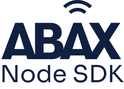

ABAX API client built using Typescript for Node.js. This SDK is used by multiple
integrations with the ABAX API, but it is still in early development.

## Features

- Built with Typescript
- Uses [undici](https://github.com/nodejs/undici) (Faster requests 🚀)
- Pure ESM

The endpoints currently supported are:

- GET v1/vehicles
- GET v1/trips
- GET v1/trips/odometerReadings
- GET v1/trips/expense
- GET v2/equipment
- GET v2/equipment/{id}

**Note**: We have yet to add any tests, but we will add them as soon as
possible.

## Installation

```bash
pnpm add abax-node-sdk
```

## Usage

```typescript
import { AbaxClient } from 'abax-node-sdk';

const client = new AbaxClient({
  apiKey: 'xxxxx',
});

client.getVehicles().then(vehicles => {
  console.log(vehicles);
});
```

## Contributing

We love contributions! Please read our [Contributing Guide](CONTRIBUTING.md) to
learn how to contribute to this project.
